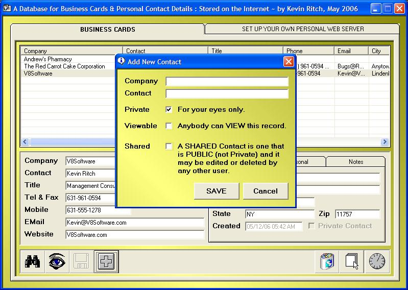



## Over 5,000 Concurrent Users can access a WEB Database with this\! NB: \*\*\* NORTON NEWS \*\*\*

### Description

***NEWS*** This has been compiled and tried by a client with Norton Anti... Guess what? It does NOT (repeat; NOT) come up with their usual jolly annoying window warning the user about an application trying to connect to the Internet.... AT LAST a neat WORKAROUND!!!... USE with confidence....

....There are 3 important features.

First, this VB front-end uses a silent WebBrowser object to work around security software objections.

Second, because all timestamps are stored in GMT format and reformatted when displayed, users can work in REAL-TIME.

Thirdly, because of the way that the back-end ASP manages the data, there is no limit to the number of people who may work with the database "simultaneously".
 
### More Info
 

             |
---                |---
**Submitted On**   |2006-05-15 19:04:32
**By**             |[Kevin Ritch](https://github.com/Planet-Source-Code/PSCIndex/blob/master/ByAuthor/kevin-ritch.md)
**Level**          |Intermediate
**User Rating**    |5.0 (55 globes from 11 users)
**Compatibility**  |VB 6\.0, ASP \(Active Server Pages\) 
**Category**       |[Complete Applications](https://github.com/Planet-Source-Code/PSCIndex/blob/master/ByCategory/complete-applications__1-27.md)
**World**          |[Visual Basic](https://github.com/Planet-Source-Code/PSCIndex/blob/master/ByWorld/visual-basic.md)
**Archive File**   |[A\_Business1994495152006\.zip](https://github.com/Planet-Source-Code/kevin-ritch-over-5-000-concurrent-users-can-access-a-web-database-with-this-nb-norton-news__1-65363/archive/master.zip)

